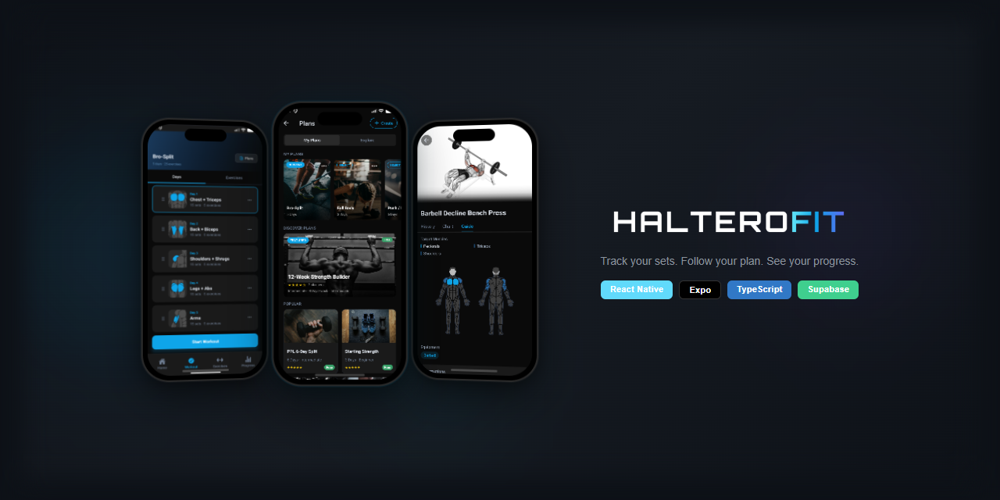
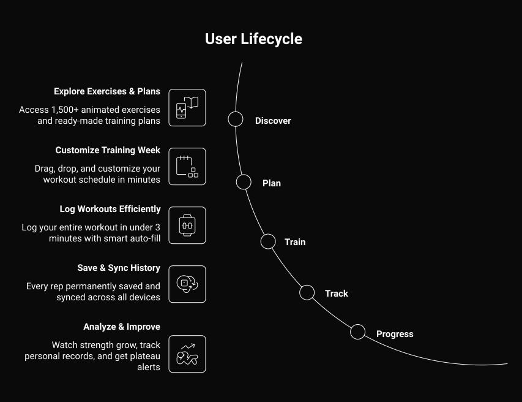
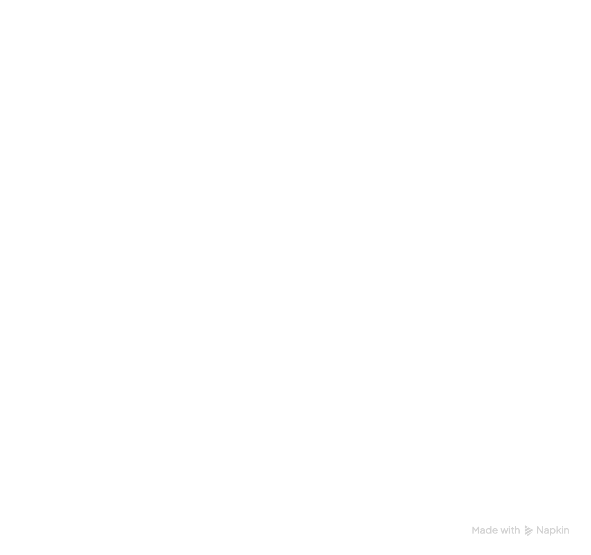

<picture>
  <source media="(prefers-color-scheme: dark)" srcset="assets/branding/icon.svg" />
  <source media="(prefers-color-scheme: light)" srcset="assets/branding/icon-dark.svg" />
  
</picture>

 

<picture>
  <source media="(prefers-color-scheme: dark)" srcset="assets/branding/wordmark.png" />
  <source media="(prefers-color-scheme: light)" srcset="assets/branding/wordmark-dark.png" />
  
</picture>

 

🇬🇧 <a href="README.md">Read in English</a>

 

## À propos

Une application de suivi d'entraînement conçue pour les sportifs qui prennent leur progression au sérieux. Parcourez plus de 1 300 exercices avec démonstrations GIF animées, créez des plans d'entraînement personnalisés avec réorganisation par glisser-déposer, et découvrez des programmes pré-construits — le tout en mode hors-ligne. Construit entièrement en solo.

 

## Fonctionnalités

### Bibliothèque d'exercices
Parcourez **plus de 1 300 exercices** de la base de données ExerciseDB. Chaque exercice inclut une démonstration GIF animée, des instructions étape par étape, et un **highlighter musculaire interactif** — touchez n'importe quel muscle sur un diagramme corporel pour voir quels exercices le ciblent.

### Planification d'entraînement
Créez des **plans multi-jours personnalisés** avec réorganisation par glisser-déposer pour les jours et les exercices. Modifiez les noms des jours, ajoutez des exercices depuis la bibliothèque, et organisez votre semaine d'entraînement exactement comme vous le souhaitez.

### Marketplace de plans
Parcourez et acquérez des **programmes d'entraînement pré-construits** — filtrez par catégorie (Force, Hypertrophie, Débutant, Powerlifting) et par prix (Gratuit / Premium). Les plans acquis sont entièrement modifiables.

### Hors-ligne d'abord
**Chaque fonctionnalité fonctionne sans internet.** Toutes les données sont stockées sur l'appareil via WatermelonDB (SQLite) et se synchronisent avec Supabase PostgreSQL lorsqu'une connexion est disponible. Zéro perte de données, même en plein entraînement.

### Mode sombre natif
Conçu pour les **environnements de gym** — interface sombre à haut contraste, facile à lire entre les séries, même en faible luminosité.

 

## Stack technique

| Catégorie | Technologie |
|-----------|------------|
| **Framework** | React Native 0.81 · Expo SDK 54 · New Architecture (Fabric) |
| **Langage** | TypeScript (mode strict) |
| **Navigation** | Expo Router v3 (routing basé sur fichiers) |
| **Base de données** | WatermelonDB (SQLite hors-ligne) |
| **Backend** | Supabase (Auth + PostgreSQL + sync) |
| **État** | Zustand + react-native-mmkv |
| **Style** | NativeWind v4 + Tailwind CSS |
| **Animations** | React Native Reanimated 4 |
| **Listes** | FlashList 2.0 |
| **Build** | pnpm + Turborepo monorepo · EAS Build |
| **Monitoring** | Sentry |
| **Optimisation** | React Compiler (mémoïsation automatique) |

 

## Architecture

- **Monorepo** — pnpm workspaces + Turborepo (app mobile, companion web planifié, packages partagés)
- **Synchronisation hors-ligne** — WatermelonDB sur l'appareil ↔ sync bidirectionnelle ↔ Supabase PostgreSQL
- **Architecture en couches** — Screens → Components → Hooks → Services → Stores

 

## Points forts du projet

- Construit **entièrement en solo** de zéro à production-ready
- **New Architecture** (Fabric renderer) activée dès le départ
- **React Compiler** pour l'optimisation automatique des performances
- Vrai **offline-first** — base de données locale complète avec sync bidirectionnelle, pas de simples appels API en cache
- **Drag-to-reorder** custom avec les gesture handlers de Reanimated sur le UI thread
- **Diagramme SVG interactif** du corps avec détection de tap par muscle

 

## À propos de ce dépôt

> Ce dépôt est un **showcase**. Le code source est maintenu dans un dépôt privé.

J'ai construit Halterofit comme projet solo pour pousser mes compétences en React Native et en développement mobile de production. C'est un projet en cours — je développe activement de nouvelles fonctionnalités et peaufine l'expérience utilisateur.

Pour un walkthrough du code, une démo en direct, ou pour discuter des décisions techniques derrière ce projet, n'hésitez pas à me contacter.

**Patrick Patenaude**

